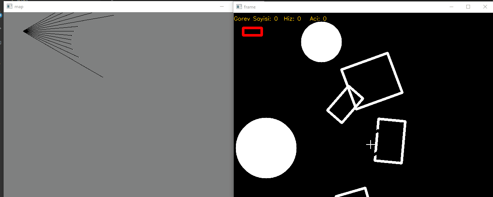

# Map Extraction Simulator

Robotların fiziksel ortamdaki hareketleri 2D olarak simüle eder. Bu simülasyon robotların ortamı haritalandırması için hazırlanmıştır.

## Özellikler

- [ ] Birden fazla robot çalıştırma
- [X] Ortama farklı boyutlarda rastgele cisimler ekleme
- [ ] Çarpışma kontrolü
- [X] Lidar tarama
- [X] Manuel robot hareketi
- [ ] Otonom robot hareketi

## Kullanım

Sisteminizde Python 3.x kurulu olmaldır.

`pip install -r requirement.txt` kodunu çalıştırınız.

Sonra `main.py` dosyasını çalıştırınız.

## Klavye kontrolü

Robotu kontrol etmek için

Fare ile gitmesini istediğiniz konuma tıklayın.

`1` Robot bilgilerini göster / gizle

`2` Robot haritasını göster / gizle

`Esc` Çıkış
